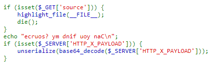

# ImaginaryCTF-2021
## RooS World:
  View page source lên thì thấy có một đoạn Javascript
  
  

  Đây là JSFuck 
  Mình sử dụng một tool online để chuyển JSFuck này về Javascript thông thường để dễ hiểu:
  
  

  Base64 decode chuỗi trên ta được `flag`
  
  **ictf{1nsp3ct0r_r00_g0es_th0nk}**
## SaSS:
  Bài này người cho chúng ta một file source code:
  
  

  Đầu tiên mình sử dụng `ls` để list ra danh sách file:
  
  

  Khi list ra thì mình thấy có một file là `flag.txt`, khả năng rất cao là flag nằm trong file này.
  
  Vì `cat` đã bị filter nên mình sử dụng `nl *` , lệnh này sẽ hiển thị tất cả các file trong thư mục hiện có.
  
  

   **ictf{:roocu:roocu:roocu:roocu:roocu:roocursion:rsion:rsion:rsion:rsion:rsion:_473fc2d1}**
## Awkward_bypass

  

  
 
   Sau khi đọc file sourse cung cấp thì dạng bài này chính là sqli
   
   Hiểu đơn giản thì nếu chúng ta login thất bại thì sẽ show ra `Error`, ngược lại sẽ render ra một trang `user.html`
   
   Nhìn vào blacklist chủa bài này có vẻ hầu hết các từ cần thiết đều bị filter, nhưng chúng ta hoàn toàn có thể bypass được bằng 
   chính hàm `checkCreds` bên dưới
   
   Trong hàm này sẽ thực hiện thay thế từ trong payload chúng ta truyền vào bằng `''` nếu trong payload của chúng ta có từ nằm trong blacklist.
   
  **Ví dụ:**

  

  Nhưng vì việc kiếm tra và thay thế này chỉ được thực hiện duy nhất một lần nên chúng ta hoàn toàn có thể thực hiện lồng các chuỗi lại với nhau để bypass:

  
  
  Thử với `username=' oorr 1--&pass=''`:

  

  Vậy `flag` không nằm trong `user.html` vậy có khả năng rất cao là `flag` đang nằm trong `password`.
  
  Trước tiên mình thử kiếm tra xem các kí tự đầu của `password` có phải là `ictf` không thì kết quả là đúng nên yên tâm password là `flag`.
  
  Mình sử dụng Burp để thực hiện brute force tìm độ dài của `password`  thì được kết quả là 33 tiếp theo sẽ tìm từng kí tự với hàm `substr()`
  
  Payload tìm length: `username=' oorr length(paassswoorrd)=1--&pass=''` (mình thử từ 1 đến 50 bằng Burp Intruder)
  
  Nếu như `password` là `flag` thì nó sẽ có dạng `ictf{...}` nên mình chỉ cần tìm từ kí tự thứ 6 đến 32:

  

  Sử dụng Burp Intruder chọn payload cho biến thứ nhất chạy từ 6 đến 32 biến thứ 2 cho kí tự mình nghĩ có thể có trong flag
  (alphabet, number,_,...) thì cuối cùng sẽ tìm được tất cả các kí tự trong `flag`.
  
## Buid-A_Website
  Dạng bài: SSTI
  
  Vì mình lỡ Shift+Delete file code của bài này trước khi viết writeup nên mình không có file code để show ra
  
  Nhưng sau giải khi mình vào thử link chal thì mình thấy vẫn được mở, nếu mọi người quan tâm có thể vào link này để vọc:
  https://build-a-website.chal.imaginaryctf.org/
  
  Thử với payload: `{{url_for.__globals.__.__builtins__.open("flag.txt").read()}}`
  
  Nhưng trong bài này từ `bal` bị filter nên chúng ta cần phải thay đổi payload một tí thành:
  
  `{{url_for["__globa""ls__"].__builtins__.open("flag.txt").read()}}`
  
  
  
  

## Destructoid:
  Đối với bài này mình đã tham khảo một số writeup của các bạn/anh nhưng mình vẫn viết lại writeup theo những gì mà mình đã hiểu được, để có thể ghi nhớ và nếu cần có thể tham   khảo lại.
  
  **Dạng bài: object injection**

  

  

  **Những kiến thức cần biết trước khi thực hiện bài này:**
  ```
  __construct() sẽ tự động được gọi khi tạo một object
  __wakeup() sẽ tự động được gọi khi unserialize một object
  __toString sẽ tự động được gọi khi echo object
  ```
  **Phân tích những điều kiện để có được `flag`:**

  `__destruct` được gọi và thực hiên in `flag`: `$this.cleanup = 'flag'` hoặc `'nonelfag'`, `$printflag=true`
  
  Để `$printflag=true` thì `__toString` của Y phải được gọi -> cần phải thực hiện `echo` một object Y -> `__wakeup` của Y phải được gọi.
  
  Để `__wakeup` được gọi thì phải thực hiện `unserialize` một object Y.
  
  Đầu tiên mình thử với `new Y( new X('flag'))` nhưng không thành công:

  

  

  Và đây là lí do:

  

  Khi payload được truyền vào và sau đó `unserialize` thì X object bên trong sẽ nhảy vào `__wakeup`
  
  Nên để echo được object của Y bên trong  `__wakeup` thì cần lồng thêm một Y nữa:

  

  
  
  
  ## Thank you for being here!
  # End


