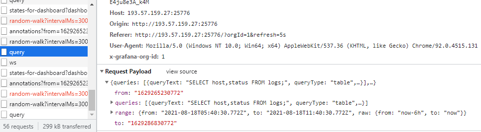
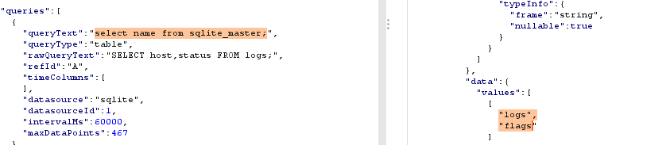
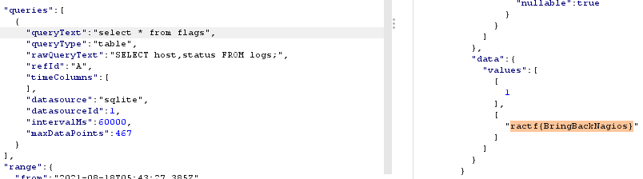
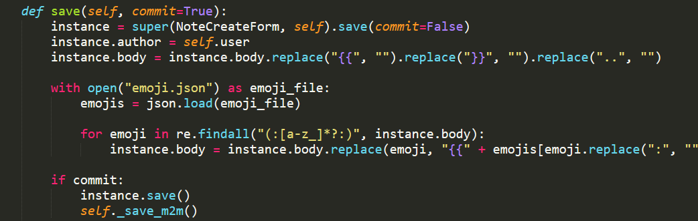
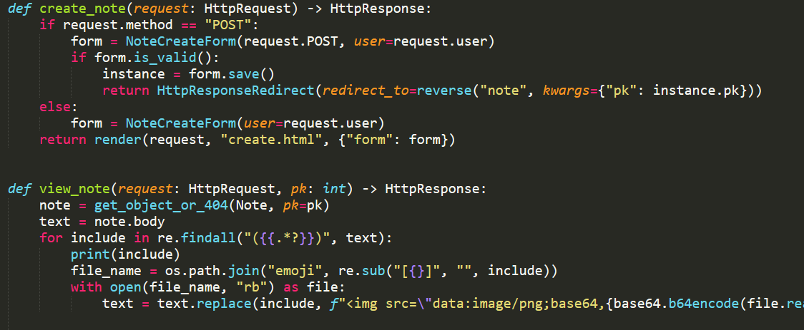

# RaCTF

## Really Awesome Monitoring Dashboard (250 pts)
### Dạng bài: sqlite

Mở tab network trong browser vào query chúng ta có thể thấy ở đây truy vấn được truyền đi:



Chúng ta có thể sửa đổi câu truy vấn trong này theo mong muốn:

#### Lấy danh sách bảng trong database:

```select name from sqlite_master```



#### Lấy Flag

```select * from flags```



#### Flag: ractf{BringBackNagios}

## Emojibook (350 pts)

### Dạng bài : LFI

Trong bài này thì ta tập trung vào 2 file code chính là forms.py và views.py






Trong views.py sẽ kiếm tra nếu như dữ liệu được nằm trong cặp dấu `{{..}}` thì sẽ view ảnh trong folder emoji ra còn nếu không thì sẽ view đúng thông tin do user nhập vào.

Nhưng trong file forms.py thì chúng ta có thể thấy nó thực hiện kiểm tra dữ liệu do người dùng nhập vào nếu như có `{{` `}}` `..` thì sẽ bị loại bỏ

Nhưng chúng ta có thế bypass filter này bằng cách nhập vào {..{your_text_here}..} thì khi `..` bị loại bỏ sẽ còn lại {{your_text_here}}

Okay đến đây thì chúng ta có thể lấy được file từ local lên nhưng như chúng ta thấy thì file chỉ được lấy từ trong folder emoji. 

Có một điều lưu ý ở đây là flag chúng ta được nằm trong `/flag.txt` và `os.path.join` sẽ bỏ qua các giá trị phía trước nếu giá trị cuối cùng mình cung cấp là một hard link

Rồi đến đây là chúng ta chỉ cần truyền vào là {..{/flag.txt}..} thì sẽ lấy được flag, nhưng data sẽ nằm ở dạng base64 decode nên chúng ta cần phải decode để lấy được flag.


#### Flag: ractf{dj4ng0_lfi}


