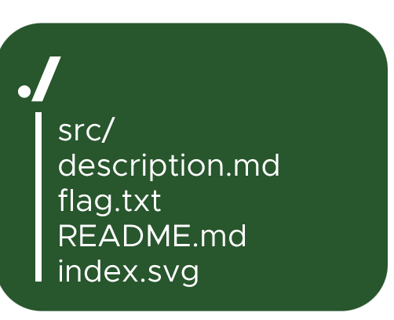
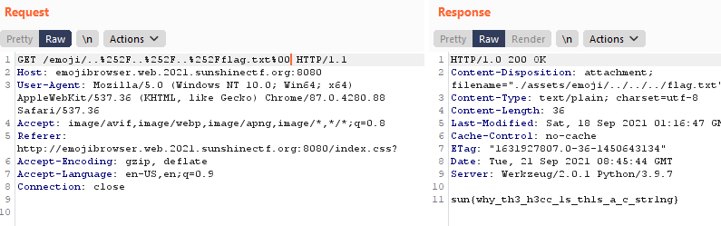

# SunshineCTF 
## Emoji Browser

Like a joke, When I see a robot icon on the web page, I try to access `robots.txt` file and I can find out flag is in `/emoji/../../../flag.txt`

When we access the web page, we can see a default icon. It is loaded from `/assets/emoji/index.svg`. With any input for `/emoji/:input`, I am alway shown this default icon.

First I try urlencoded path, and I receive `Error 404 - page is not found`. Then I try to double urlencoded path, and it works for me.

But if you only use urlencoded, you can't get `flag.txt`, it only shows svg file. 



You can use `%00` to bypass this, so the full payload is:
```
/emoji/..%252F..%252F..%252Fflag.txt%00
```



### Flag: sun{why_th3_h3cc_1s_th1s_a_c_str1ng}

