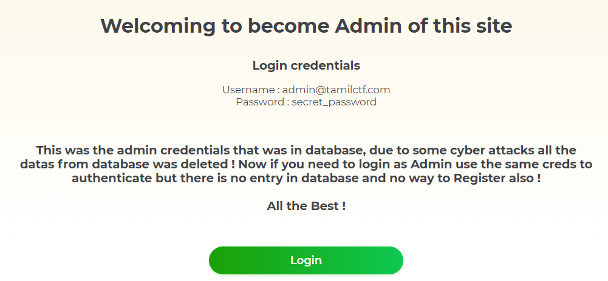
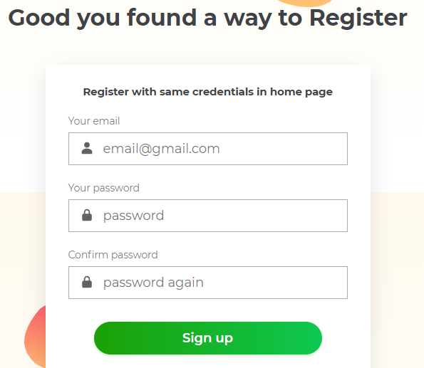
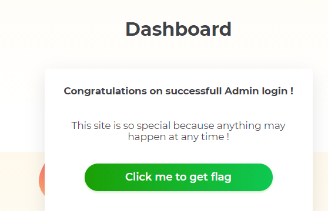
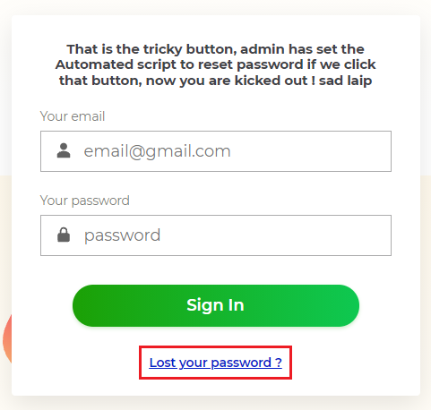
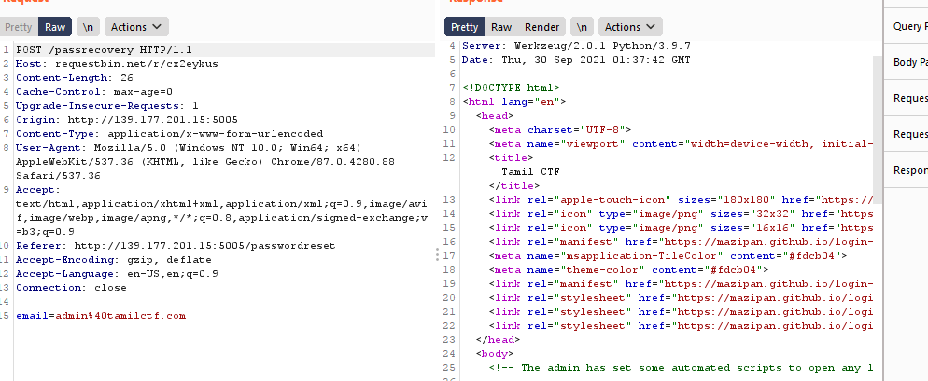
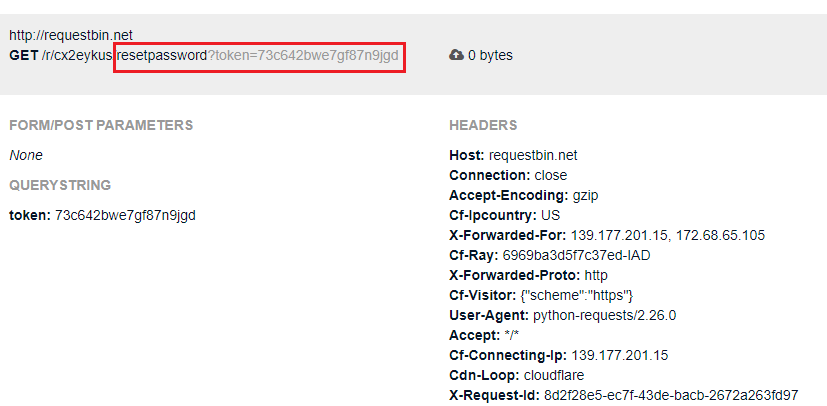
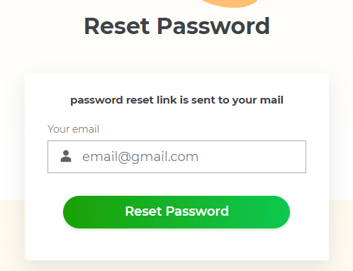
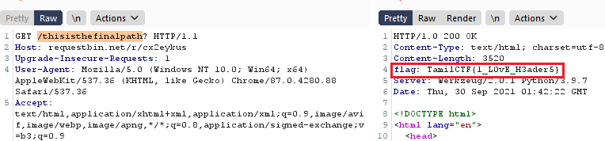

# Category: Web 

They said that noway to register, I try to login in login page. Of course it's not successful but I get the path : `/account/login`

Try to change the path to `/account/register` and I get register page:

Thay say: "Register with same credentials in home page". So I register with email is `admin@tamilctf.com` and password is `secret_password`.

After login you will receive message: 'Congratulations on successfull Admin login !'.

Try to click `Click me to get flag`, but no flag for you. Just a joke.

You will be redirected to a page with path is `/flagishere`. In this page, you can login and choose to reset your password if you lost it. 

Click `Lost your password` you will get a page to reset password, Enter email with value `admin@tamilctf.com`, and the response is `password reset link is sent to your mail`.

Try to view source: You will see a comment with content: "The admin has set some automated scripts to open any links that comes to his mail"

Any link? What happen if we use our site?

I use burpsuite and change Host header to my site:

Check my site and I receive the token:

Go to `/resetpassword` path with token parameter, you can create new password:

After reset password you will login with admin successfully again. They said that flag is sent. But where is flag? :'(

I spend much time to find flag, finally I found it is in response header, lol.

## End.
## Thank you for your reading!

